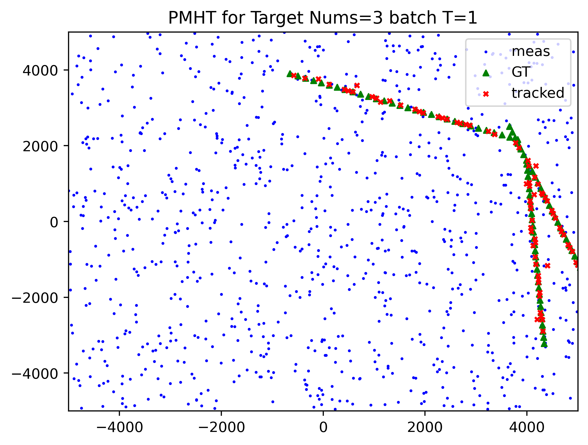

# The Code for Probabilistic Multiple Hypothesis Tracking Algorithm

## 1. Prepare the Data
- For personal reason, I am unable to supply the `raw_data.txt`. 
But I add a simulation module to generate the dummy data.

- I notice the recent issues about missing files during runing the code. 
I have already update a new `setup.py` and `README.md` to make project more completely.

- I have verified that the code can successfully work with follow instructions.

- You would find the figure of tracking result under `result` directory.


## 2. Install

### Prerequisite:
- Please pre install the necessary packages like numpy, matplotlib and so on.

### Install PMHT:
```
python setup develop
```

## 3. Usage 
```
python run_pmht.py
```
After runing the code, you would get some log in terminals and 
the figure of tracking result under `result` directory.  
